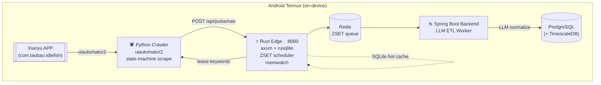

# HardwarePulse · 硬件脉搏

> **A Termux-native, three-runtime pipeline that snipes second-hand hardware deals on Xianyu with LLM-assisted normalization.**
>
> 基于 Android Termux 裸机部署的三语言（Rust / Java / Python）流水线，用 LLM 在链路末端做语义清洗，帮「垃圾佬 / Homelab / PCDN 玩家」自动捡漏闲鱼二手硬件。

[English](#english) · [中文](#中文)


---

<a id="english"></a>

## TL;DR

HardwarePulse turns an idle Android phone into a fully-autonomous price-tracking appliance. A **Rust edge** (axum + SQLite) owns the on-device HTTP surface and keyword scheduler. A **Python crawler** drives the real Xianyu app through `uiautomator2` — no reverse-engineered REST, no headless browser. A **Spring Boot ETL** worker consumes the raw lake, normalizes listings via LLM, and writes canonical SKUs + time-series prices into PostgreSQL (TimescaleDB if available). Everything runs **on the phone itself**, inside Termux, without Docker and without root.

## Why it exists · 为什么做这个

二手矿渣、X99/N100 小主机、CX341A 软路由、DDR4 ECC 内存 —— 闲鱼上的好价格**秒级消失**。手工刷新烧眼睛、脚本化 REST 抓取面临阿里系反爬墙。HardwarePulse 用「真机 + uiautomator2」绕开反爬，把盯盘这件事下放到一台吃灰安卓机上，7×24 跑。

## Architecture · 架构



### Three-layer data model (see `init-scripts/01_schema.sql`)

| Layer | Table | Purpose |
|---|---|---|
| L1 Raw lake | `raw_listings` | Write-optimized. Raw title / price / JSONB seller / HTML snapshot. Idempotent on `external_id`. |
| L2 Canonical | `standard_skus` | LLM-extracted brand + model + `key_specs` JSONB. Deduplicated. |
| L3 Time series | `price_history` | TimescaleDB hypertable (falls back to plain table if extension unavailable). |
| L4 Decision | `xianyu_snipes`, `pcdn_roi_metrics` | Confidence-scored snipe candidates; ROI for PCDN/mining resale. |

## Components · 组件

| Dir | Runtime | Role |
|---|---|---|
| `hardware-pulse-edge/` | Rust 2021 (axum + tokio + rusqlite) | On-device HTTP ingest, keyword lease scheduler, SQLite hot cache, memwatch, built-in ETL worker. |
| `hardware-pulse-crawler/` | Python 3.11+ | uiautomator2-driven Xianyu app automation. State-machine scrape (no `dump_hierarchy`, no blind sleeps), two-stage list → detail, MD5 dedup, auto-stop on N swipes without new items. |
| `hardware-pulse-backend/` | Java 17 · Spring Boot 3.2 | LLM-powered ETL. Raw → canonical SKU, price history emission, worker pool with inflight watchdog. |
| `init-scripts/` | SQL | PostgreSQL DDL (TimescaleDB-optional). |
| `setup_env.sh`, `start_all.sh`, `stop_all.sh` | Termux bash | One-shot provisioning + lifecycle. Self-healing `pkg install` if deps missing. |

## Quickstart · 5 分钟跑起来

> Prereq · 前置：一台能开发者模式的 Android 机，装好 [Termux](https://termux.dev/) + F-Droid 版 `Termux:API`，USB 调试打开。

```bash
# 1. clone
git clone https://github.com/Seal-Re/hardware-pulse.git && cd hardware-pulse

# 2. copy env & fill LLM key
cp .env.example .env
$EDITOR .env    # SPRING_DATASOURCE_* + APP_LLM_API_KEY

# 3. one-shot Termux bootstrap (installs pg/redis/openjdk/python, initdb, creates role+db, applies schema)
./setup_env.sh

# 4. build Rust edge (one-time)
cd hardware-pulse-edge && cargo build --release && cd ..

# 5. start everything
./start_all.sh

# 6. tail logs
tail -f logs/edge.log logs/crawler.log
```

Stop backend + crawler (middleware left running):

```bash
./stop_all.sh
```

Config lives in `hardware-pulse-crawler/config.yml` — thresholds are the keywords the crawler seeds into the edge scheduler.

## Technical highlights · 技术亮点 (STAR)

<details>
<summary><b>⚡ Three-language runtime on one phone</b> — Rust edge, Java ETL, Python automation</summary>

- **S**ituation: pure-Java backend was OOM-killed on low-end Android (2 GB heap + Spring startup + uiautomator2 python interpreter + PG + Redis).
- **T**ask: shrink the always-on surface to something Termux can keep alive 7×24.
- **A**ction: ported the ingest HTTP, SQLite cache, keyword ZSET scheduler, and memwatch from the original Java backend to a **single Rust binary** (`~15 MB`, `~20 MB` RSS). Java stayed only for the LLM-ETL worker, which can be paused when memory is tight.
- **R**esult: steady-state memory on a 4 GB phone: `edge ~20 MB + crawler ~180 MB + redis ~8 MB + pg ~60 MB + java (bursty) ~400 MB`. Phone stays warm, not hot.
</details>

<details>
<summary><b>🤖 uiautomator2 state-machine scraper</b> — no blind sleeps, no XML parsing</summary>

- Abandoned `dump_hierarchy()` + XPath (slow, 2-3 s per dump, brittle across Xianyu app versions).
- Replaced with **explicit UI waits + state transitions**: `list_ready → prefilter → detail_open → parsed → next_swipe`.
- In-memory MD5 dedup on title+price+seller. Auto-terminate after 3 consecutive swipes with no new items.
- Hard caps on payload size (desc 800 chars, snapshot 2 KB, detail dump 1.2 KB) prevent memory blowup on chatty sellers.
</details>

<details>
<summary><b>🧠 LLM as ETL, not as chat</b></summary>

Raw titles on Xianyu are garbage: "垃圾佬神U 1680v4 22C44T 成色完美便宜出了". The ETL worker asks the LLM to emit strict JSON matching `HardwareSpecDTO` — brand, model, category enum, `key_specs` (cores, TDP, memory channels, …). Invalid JSON is rejected and re-queued with exponential backoff. Prompt-cached system prompt keeps per-listing cost low.
</details>

<details>
<summary><b>🗄️ TimescaleDB-optional schema</b></summary>

`init-scripts/01_schema.sql` probes `pg_available_extensions`: if TimescaleDB is present, `price_history` is turned into a hypertable; if not, it stays a plain table with the same indexes. Works on Termux's vanilla PostgreSQL and on a beefy server with Timescale.
</details>

<details>
<summary><b>🪫 Memwatch + inflight watchdog</b></summary>

Rust edge samples RSS at 1 Hz into `mem_watch.log`. Java backend ships a `SpiderInflightWatchdog` that times out crawler leases (default 180 s) and returns keywords to the queue, so a phone reboot mid-scrape doesn't drop work.
</details>

## Roadmap · 路线图

- [x] Termux bare-metal deployment (no Docker)
- [x] Rust edge + Python crawler + Java ETL three-runtime split
- [x] LLM-based canonicalization (brand / model / key_specs)
- [x] TimescaleDB-optional time series
- [ ] Push notifications via Termux:API when confidence ≥ 80
- [ ] Web dashboard (price trend lines, ROI curve)
- [ ] Second platform: JD 2nd-hand, PDD
- [ ] Confidence-score model fine-tune (local Qwen-2.5 via `llama.cpp` in Termux)
- [ ] Auto-snipe bot (ask-to-buy message draft → human confirm)

## Repo layout · 目录

```
hardware-pulse/
├── hardware-pulse-edge/        # Rust ingest + scheduler + SQLite
├── hardware-pulse-crawler/     # Python uiautomator2 Xianyu spider
├── hardware-pulse-backend/     # Spring Boot LLM ETL worker
├── init-scripts/01_schema.sql  # PostgreSQL DDL
├── setup_env.sh                # Termux one-shot bootstrap
├── start_all.sh / stop_all.sh  # Lifecycle
├── termux_audit.py             # Repo hygiene audit (forbids sudo/apt-get in scripts)
└── .env.example                # Datasource + LLM key template
```

<a id="中文"></a>

## 中文速读

- **定位**：跑在安卓 Termux 上的 7×24 闲鱼硬件捡漏流水线，不依赖 Docker、不依赖 root。
- **为什么三语言**：边缘态（常驻 HTTP + 调度 + SQLite 缓存）用 Rust 压低常驻内存；LLM 清洗这种「CPU 密集 + 偶发」的任务放在 Spring Boot，可按需挂起；安卓 UI 自动化除 Python `uiautomator2` 之外没更好选择。
- **数据分层**：`raw_listings`（写优化落盘）→ `standard_skus`（LLM 提纯）→ `price_history`（TimescaleDB 可选）→ `xianyu_snipes`（带置信度的捡漏候选）。
- **反爬路径**：绕开阿里 H5 REST，直接驱动官方 APP；用状态机 + 显式等待替代 `dump_hierarchy` + XPath，提升稳定性与速度。
- **当前状态**：主链路跑通，通知推送与 Web 看板在路线图上。

## License

MIT © [Seal-Re](https://github.com/Seal-Re)
